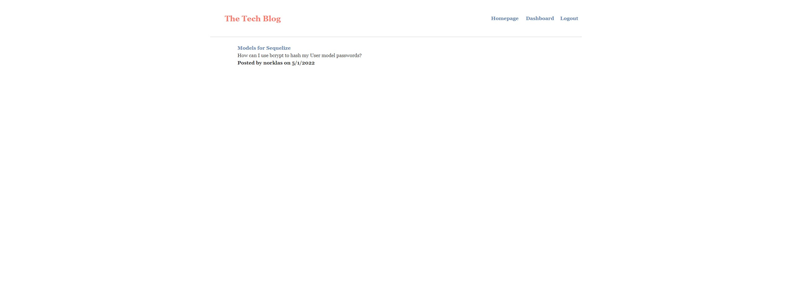

# Tech Blog

## Description

This project is a CMS-style blog where developers can publish their blog posts and comment on other developers post. This application follows the **MVC** paradigm in it's structure and uses **Handlebars.js** as the templating language, **Sequelize** as the ORM, and the **express-session** npm package for authentication.

I built this project to get familiarized with the **MVC** structure, as well as furthering my knowledge with **Sequelize**, **bcrypt**, **express-session**. Also learning how to use a templating engine, such as, **Handlebars.js**.

## Installation

The user should clone the repository from GitHub. Once the repo is cloned, simply type:

```
npm i
```

Once the required dependencies have been installed, simply type:

```
npm start
```

This will start the server and you can then go to localhost:3001 to view the webpage

## Usage

This application will allow users to sign up if they are not a member. Once logged in, they can view their dashboard of posts to view, add, edit, or delete blog posts, as well as comment on others.

View on Heroku: https://norklas-tech-blog.herokuapp.com/



## Credits

Sequelize documentation: https://sequelize.org/docs/v6/getting-started/

express-session documentation: https://www.npmjs.com/package/express-session

express-handlebars documentation: https://www.npmjs.com/package/express-handlebars

bcrypt documentation: https://www.npmjs.com/package/bcrypt